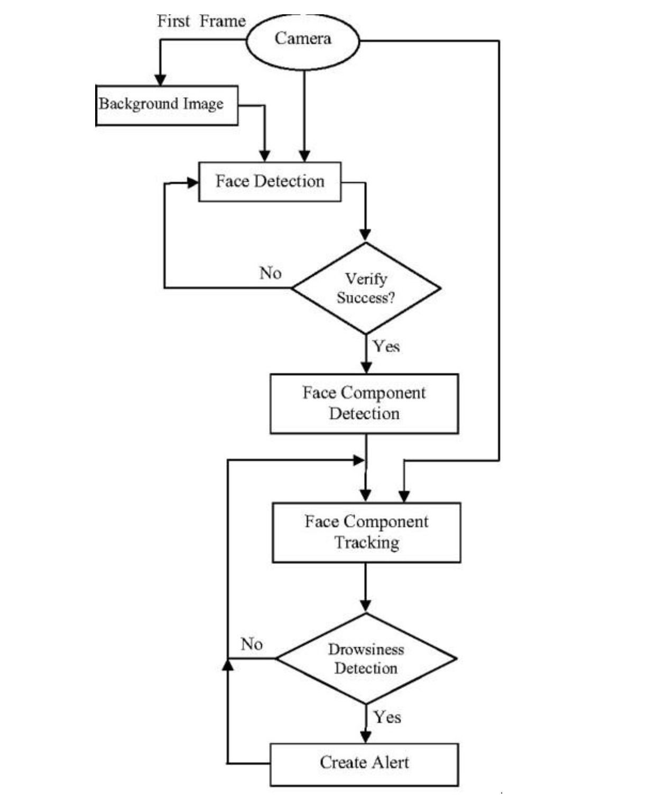
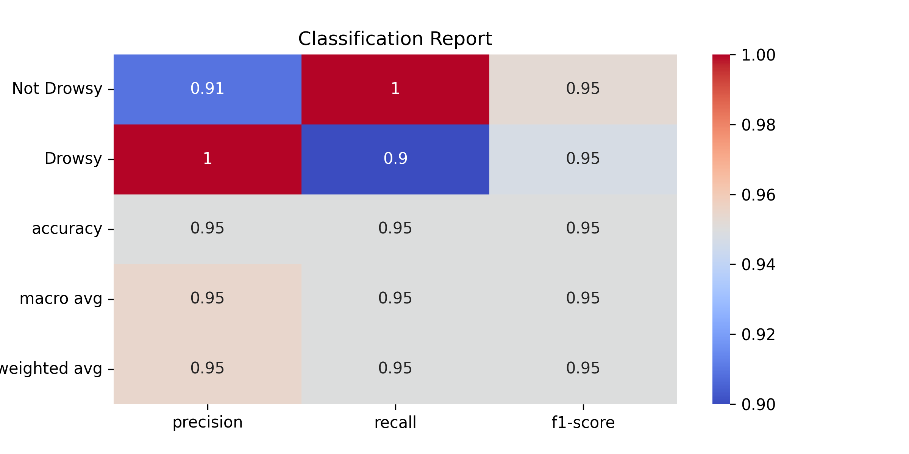

# Driver-Drowsiness-Detection-Using-AI

## Abstract
Drowsiness and fatigue are leading causes of road accidents worldwide. This project proposes a real-time, non-invasive system to monitor drivers for signs of fatigue using computer vision techniques. By analyzing Eye Aspect Ratio (EAR) and Mouth Aspect Ratio (MAR), the system can detect drowsiness indicators such as prolonged eye closure and yawning, issuing alerts to enhance road safety.

---

## Table of Contents
1. [Introduction](#introduction)
2. [Problem Statement](#problem-statement)
3. [Justification](#justification)
4. [Proposed Solution](#proposed-solution)
5. [Objectives](#objectives)
6. [Existing Systems](#existing-systems)
7. [Methodology](#methodology)
    - [Research Methodology](#research-methodology)
    - [Literature Review](#literature-review)
    - [Proposed Work](#proposed-work)
8. [Key Metrics: EAR and MAR](#key-metrics-ear-and-mar)
9. [Algorithm and Implementation](#algorithm-and-implementation)
    - [Algorithmic Steps](#algorithmic-steps)
    - [Tools and Libraries](#tools-and-libraries)
10. [Experimental Results](#experimental-results)
11. [Conclusion and Future Scope](#conclusion-and-future-scope)
12. [References](#references)

---

## Introduction

### Background
Driver fatigue significantly contributes to road accidents. Technologies that accurately detect drowsiness are crucial for preventing such incidents and ensuring road safety.

---

## Problem Statement
Current drowsiness detection systems are either too costly or provide unreliable results. This project addresses these issues by combining EAR and MAR metrics to detect signs of drowsiness accurately and affordably.

---

## Justification
This research focuses on developing a system that is:
- **Cost-effective:** Uses affordable cameras and software.
- **Accurate:** Leverages multiple indicators (EAR and MAR).
- **Non-invasive:** Avoids physical contact with the driver.

---

## Proposed Solution
The system processes real-time video streams of the driver's face to:
1. Detect eye closure using EAR.
2. Identify yawning using MAR.
3. Issue alerts when thresholds for drowsiness are exceeded.

---

## Objectives

### General Objective
Develop a reliable driver drowsiness detection system to prevent accidents.

### Specific Objectives
1. Continuously monitor drivers’ eyes and mouth for signs of fatigue.
2. Provide real-time alerts in the form of alarms.
3. Achieve robust detection under various lighting conditions.

---

## Existing Systems
Existing methods focus primarily on single parameters (e.g., eye closure) or physiological sensors (e.g., EEG/ECG). These approaches face limitations in cost, usability, and accuracy.

---

## Methodology

### Research Methodology
A structured approach was followed:
- Review of existing literature on drowsiness detection.
- Analysis of eye and mouth behavior as drowsiness indicators.
- Implementation using computer vision and machine learning techniques.

### Literature Review
Research highlights:
1. EAR is an effective indicator of eye closure.
2. MAR identifies yawning by tracking mouth aspect ratio changes.

### Proposed Work
The system captures video input and processes it to:
1. Detect facial landmarks.
2. Calculate EAR and MAR.
3. Issue alerts based on threshold violations.

---

## Key Metrics: EAR and MAR

### Eye Aspect Ratio (EAR)
- **Definition:** Measures the vertical-to-horizontal distance ratio of the eyes.
- **Indicator:** A continuously low EAR indicates prolonged eye closure, a sign of drowsiness.
- **Formula:**

### Mouth Aspect Ratio (MAR)
- **Definition:** Measures the vertical-to-horizontal distance ratio of the mouth.
- **Indicator:** A high MAR indicates yawning, which is a key sign of fatigue.
- **Formula:**

### **Algorithm and Implementation**

#### **Algorithmic Steps**
1. **Capture Input**:
   - Use a camera to capture the video stream of the driver.
   - This task was performed using the built-in camera of a Mac.
   - Extract the first frame to initialize the system.

2. **Face Detection**:
   - Detect the driver's face using a face detection algorithm.
   - If face detection is unsuccessful, repeat the process with subsequent frames.

3. **Face Component Detection**:
   - Identify and extract key components of the face, such as eyes and mouth, using facial landmark detection.

4. **Face Component Tracking**:
   - Track the detected components over consecutive frames for consistency.

5. **Drowsiness Detection**:
   - Calculate:
     - **Eye Aspect Ratio (EAR)**: Detect prolonged eye closures.
     - **Mouth Aspect Ratio (MAR)**: Identify yawning.
   - Check thresholds:
     - **EAR** below the threshold for consecutive frames → Eyes closed → Possible drowsiness.
     - **MAR** above the threshold for consecutive frames → Yawning → Possible fatigue.

6. **Alert Creation**:
   - If drowsiness is detected, trigger an alert system:
     - Sound an alarm using the `pygame` library for precise control of the alarm sound.
     - Optionally, reduce vehicle speed.

#### **Tools and Libraries**
- **OpenCV**: Used for real-time image processing.
- **dlib**: For detecting and tracking facial landmarks.
- **SciPy**: For calculating Euclidean distances in EAR and MAR.
- **pygame**: Used to control the playback of the alarm sound.
- **Mac Camera**: Used to capture the video stream during implementation and testing.

#### **Flowchart**
Below is the visual representation of the algorithm workflow:

This flowchart clearly outlines the steps taken by the system, from video capture to drowsiness detection and alert generation.

### Experimental Results

- **Accuracy:** 95% in standard lighting conditions.
- **Findings:** Combining EAR and MAR improves detection reliability.

#### Classification Report
The classification report summarizes the performance of the drowsiness detection model.

---

## Conclusion and Future Scope

### Conclusion
The proposed system successfully detects drowsiness using EAR and MAR. It provides a reliable, cost-effective solution for real-time driver monitoring.

### Future Scope
1. Incorporate additional metrics like head tilt or gaze direction.
2. Enhance robustness for low-light and obstructed scenarios.
3. Explore integration with vehicle control systems for automated responses.

---

## References
1. Borghini et al., "Measuring neurophysiological signals for fatigue detection," 2012.
2. Jap et al., "Using EEG components to assess fatigue algorithms," 2009.
3. Dlib and OpenCV official documentation for face and landmark detection.

---
